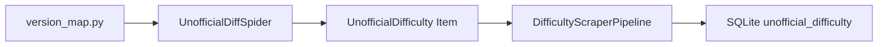
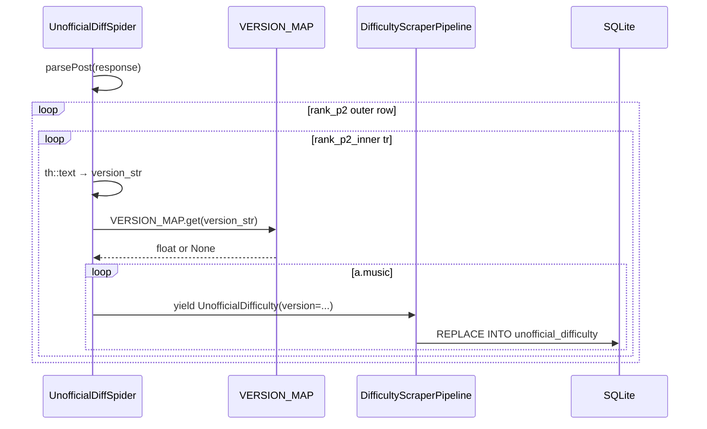

# Design Document

## Overview

unofficial-diff スパイダーが収集する各楽曲データに収録バージョン（`version: float | None`）を追加する。zasa.sakura.ne.jp の難易度表 HTML に含まれるバージョン略称を `VERSION_MAP` で浮動小数点数へ変換し、`unofficial_difficulty` テーブルおよび CSV エクスポートに反映する。

既存の Spider → Item → Pipeline → SQLite の単方向パイプラインを最小限に拡張する変更であり、新たな外部依存はない。

### Goals
- 各楽曲レコードに収録バージョン（数値）を付与する
- 既存 DB をエラーなくマイグレーションする
- `version_map.py` をコード変更なしで更新可能な設定ファイルとして提供する

### Non-Goals
- ereter.net データへの変更
- `export_csv.py` クエリの変更（`SELECT *` が自動カバー）
- バージョン略称の自動検出・自動追加

## Boundary Commitments

### This Spec Owns
- `UnofficialDifficulty` アイテムの `version` フィールド
- `unofficial_difficulty` テーブルの `version` カラム定義とマイグレーション
- バージョン略称 → 数値変換ロジック（`VERSION_MAP`）
- Spider の HTML 解析変更（バージョン略称抽出）

### Out of Boundary
- `ereternet_difficulty` テーブル・アイテムへの変更
- `export_csv.py` のクエリ変更（`SELECT *` の挙動に依存するのみ）
- `version_map.py` の数値値（ユーザーが管理）

### Allowed Dependencies
- `difficulty_scraper/version_map.py`（Spider が import）
- SQLite 標準ライブラリ（`ALTER TABLE ADD COLUMN`）

### Revalidation Triggers
- HTML の `.rank_p2_inner th` 構造変更
- バージョン略称の新規追加（`VERSION_MAP` への手動追加が必要）

## Architecture

### Existing Architecture Analysis

既存の Scrapy パイプラインは Spider → Item → Pipeline → SQLite の単方向フロー。`parsePost()` は `.rank_p2_inner a.music` を直接イテレートするため、各楽曲の `<th>` バージョン情報にアクセスできない。変更点は内側ループを `.rank_p2_inner tr` 単位に変更することのみ。

### Architecture Pattern & Boundary Map



依存方向: `VERSION_MAP` → Spider → Item → Pipeline → SQLite（上流から下流へ一方向）

### Technology Stack

| Layer | Choice / Version | Role |
|-------|-----------------|------|
| Spider | Scrapy 2.14 | HTML 解析・アイテム生成 |
| Config | Python 3.13 dict | バージョン略称 → 数値マッピング |
| Storage | SQLite (stdlib) | 永続化・マイグレーション |

## File Structure Plan

```
difficulty_scraper/
├── version_map.py          # 作成済み — VERSION_MAP 設定ファイル
├── items.py                # version フィールド追加
├── spiders/
│   └── unofficial_diff.py  # parsePost() 内側ループ変更・VERSION_MAP import
└── pipelines.py            # CREATE TABLE / ALTER TABLE / REPLACE INTO 変更
```

### Modified Files
- `difficulty_scraper/items.py` — `UnofficialDifficulty` に `version = scrapy.Field()` 追加
- `difficulty_scraper/spiders/unofficial_diff.py` — `VERSION_MAP` import、`.rank_p2_inner tr` イテレーション追加
- `difficulty_scraper/pipelines.py` — CREATE TABLE に `version REAL`、マイグレーション、REPLACE INTO に `version` 追加
- `export_csv.py` — 変更なし（`SELECT *` が自動カバー）

## System Flows



## Requirements Traceability

| 要件 | 概要 | コンポーネント |
|------|------|--------------|
| 1.1 | スクレイプ → DB 保存 | `UnofficialDiffSpider.parsePost()` + `Pipeline.save_unofficial_difficulty()` |
| 1.2 | レコードへの紐付け | `UnofficialDifficulty.version` フィールド + `version` カラム |
| 1.3 | 欠落時は NULL 保存 | `VERSION_MAP.get()` の `None` デフォルト + `REAL` 型 NULL 許容 |
| 2.1 | CSV に version カラム出力 | `export_csv.py` の `SELECT *`（変更不要） |
| 2.2 | 既存カラム + version | テーブルスキーマ拡張 |
| 3.1 | VERSION_MAP で数値変換 | `version_map.py` + Spider の `.get()` 呼び出し |
| 3.2 | マップ外は NULL | `VERSION_MAP.get(key)` → `None` |
| 3.3 | 設定ファイルとして管理 | `version_map.py`（コード変更なしで編集可能） |
| 4.1 | 既存 DB でエラーなし | `get_database()` の `ALTER TABLE` + `OperationalError` catch |
| 4.2 | 既存レコード更新 | `REPLACE INTO` に `version` 追加 |

## Components and Interfaces

| Component | Layer | Intent | Req | Key Dependencies |
|-----------|-------|--------|-----|-----------------|
| `VERSION_MAP` | Config | 略称 → float 変換表 | 3.1, 3.2, 3.3 | なし |
| `UnofficialDifficulty.version` | Item | version フィールド保持 | 1.2 | `VERSION_MAP` (P0) |
| `UnofficialDiffSpider.parsePost()` | Spider | バージョン略称抽出・マッピング | 1.1, 1.2, 1.3 | `VERSION_MAP` (P0) |
| `DifficultyScraperPipeline.get_database()` | Pipeline | スキーマ生成・マイグレーション | 4.1 | SQLite (P0) |
| `DifficultyScraperPipeline.save_unofficial_difficulty()` | Pipeline | version を含む REPLACE INTO | 1.1, 4.2 | SQLite (P0) |

### Spider Layer

#### `UnofficialDiffSpider.parsePost()` 変更仕様

| Field | Detail |
|-------|--------|
| Intent | `.rank_p2_inner tr` を単位にイテレートし、`<th>` からバージョン略称を抽出して VERSION_MAP でマッピング |
| Requirements | 1.1, 1.2, 1.3 |

**Contracts**: Batch [x]

##### Batch / Job Contract

```python
# 変更前: バージョン情報なし
for song in row.css('.rank_p2_inner a.music'):
    yield UnofficialDifficulty(song_id=..., name=..., difficulty=...,
                               level=..., unofficial_diff=diff)

# 変更後: inner_row 単位でバージョン抽出
for inner_row in row.css('.rank_p2_inner tr'):
    version_str: str | None = inner_row.css('th::text').extract_first()
    version: float | None = VERSION_MAP.get(version_str.strip()) if version_str else None
    for song in inner_row.css('a.music'):
        yield UnofficialDifficulty(..., version=version)
```

- Idempotency: `REPLACE INTO` により再実行でも結果は同一

### Pipeline Layer

#### `DifficultyScraperPipeline.get_database()` マイグレーション仕様

| Field | Detail |
|-------|--------|
| Intent | 新規 DB に `version REAL` を含む CREATE TABLE、既存 DB に ALTER TABLE でカラム追加 |
| Requirements | 4.1 |

**Contracts**: Batch [x]

```python
# CREATE TABLE に version REAL を追加（新規 DB 用）
cursor.execute(
    'CREATE TABLE IF NOT EXISTS unofficial_difficulty('
    '    song_id TEXT PRIMARY KEY, '
    '    name TEXT NOT NULL, '
    '    difficulty TEXT NOT NULL, '
    '    level INT NOT NULL, '
    '    unofficial_diff REAL NOT NULL, '
    '    version REAL'
    ');'
)
# 既存 DB マイグレーション（べき等）
try:
    cursor.execute('ALTER TABLE unofficial_difficulty ADD COLUMN version REAL')
    cls._db.commit()
except sqlite3.OperationalError:
    pass  # カラム既存の場合は無視
```

## Data Models

### Physical Data Model

```sql
CREATE TABLE IF NOT EXISTS unofficial_difficulty(
    song_id         TEXT PRIMARY KEY,
    name            TEXT NOT NULL,
    difficulty      TEXT NOT NULL,
    level           INT  NOT NULL,
    unofficial_diff REAL NOT NULL,
    version         REAL             -- NULL: VERSION_MAP に未登録
);
```

`version REAL` は NULL 許容。`REPLACE INTO` で常に上書きされるため二重登録は発生しない。

## Error Handling

| エラー | 発生箇所 | 対処 |
|--------|---------|------|
| `OperationalError: duplicate column name` | `get_database()` の `ALTER TABLE` | `except OperationalError: pass`（べき等） |
| `VERSION_MAP` キー未登録 | `parsePost()` の `.get()` | `None` を返し NULL として保存（処理継続） |
| `th::text` が `None` | `parsePost()` の `extract_first()` | `if version_str else None`（ガード済） |

## Testing Strategy

### ユニットテスト
1. `VERSION_MAP.get("GOLD")` → `14.0`（登録済みキー）
2. `VERSION_MAP.get("UNKNOWN")` → `None`（未登録キー）
3. `version_str = None` のとき `version = None`（ガードロジック）

### 統合テスト
1. `scrapy crawl unofficial_diff` 実行後、`unofficial_difficulty` に `version` カラムが存在すること
2. `version IS NOT NULL` のレコードが存在すること（バージョン登録済み楽曲）
3. `SELECT *` の結果に `version` が含まれること（CSV カバー確認）

### マイグレーションテスト
1. `version` カラムなしの既存 DB に対してスクレイパーを実行 → エラーなく完了すること
2. 完了後、`PRAGMA table_info(unofficial_difficulty)` で `version` カラムが追加されていること
